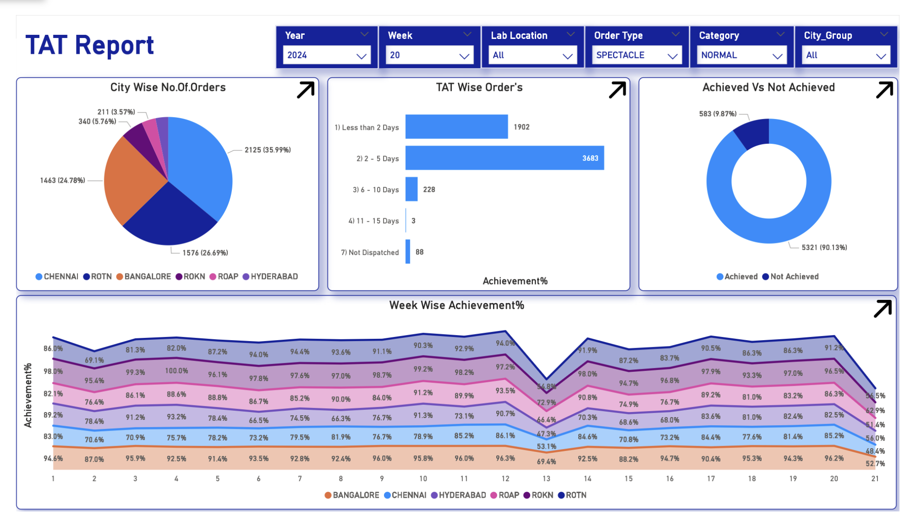
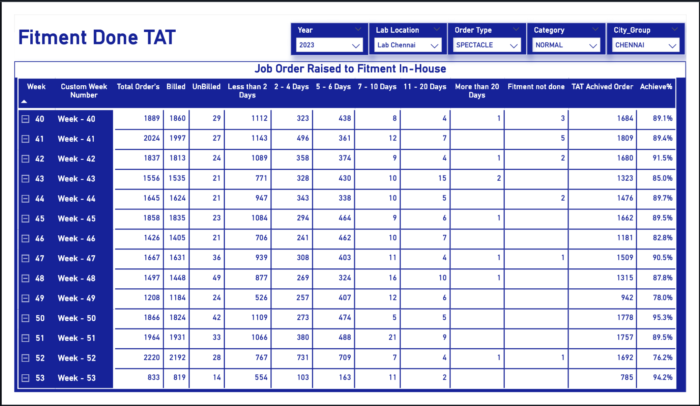
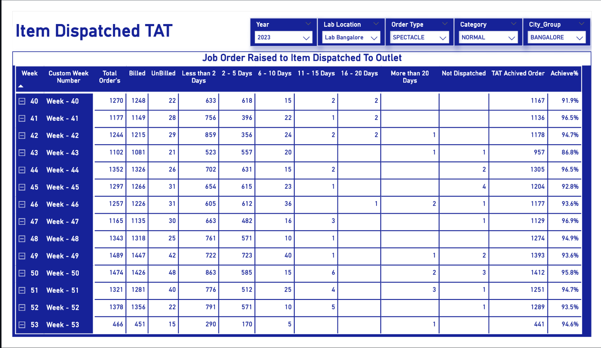

# PowerBi-dashboard
# 📊 Turn Around Time (TAT) Dashboard

## 📌 Project Overview

This Power BI dashboard was created during my internship to analyze Turn Around Time (TAT) performance.

## 🚀 Features

- Interactive Dashboard
- TAT Analysis
- KPI Tracking
- Business Insights

## 🛠️ Tools Used

- Power BI
- Excel

## 📷 Dashboard Preview

### Dashboard Overview

### KPI Analysis

### Detailed Analysis

## 📄 Files

- Turn around time(TAT) Report Final.pbix
- TAT Report.pdf

## 👩‍💻 About Me

AI & Data Science Graduate

Interested in:
- Data Analyst
- Business Analyst
- MIS Executive
- Operations Analyst
